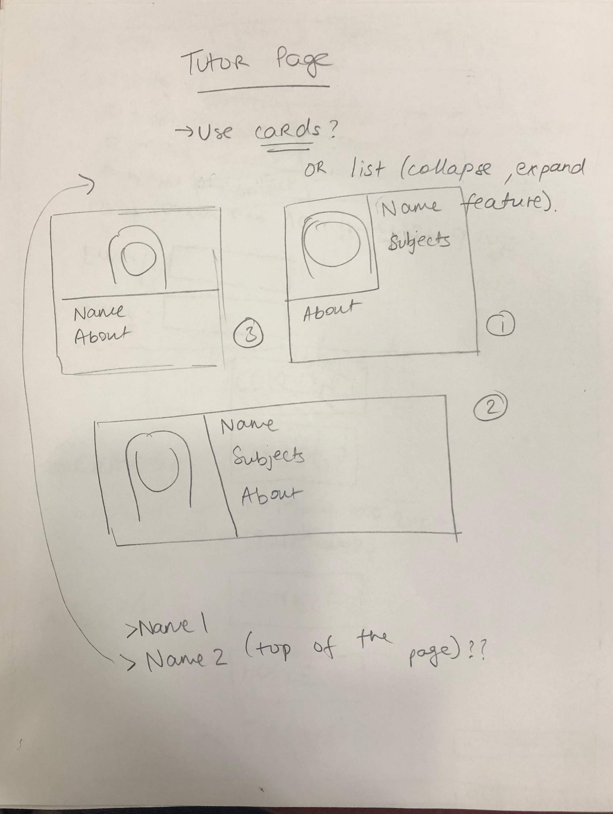

purposeful# Project 4 - Design & Plan

Your Team Name: Golden Dolphin

## Milestone 1: Design your Client's Site

### Client Selection (Milestone 1)

One of the group members, Elaine, knew an individual with a startup that required a website. We decided to get in contact with that individual through email and asked him what he wanted exactly. Based on our interaction through email it appeared that his specifications matched those of our capabilities and matched the project guidelines specification. We therefore confirmed the project with the client and got in contact with him through a group messenger call.

#### Client Description

[Tell us about your client. Who is your client? What kind of website do they want? What are their key goals?]

Client: Our client's name is Anthony Li. He is a college student at Baruch College (NYC) and he attended a specialized high school.

Website: Anthony wants a website that is easy to navigate and that explains what makes his tutoring service different from the rest. He wants it to emphasize that his tutors all passed the Specialized High School Admission Test (SHSAT) and attend specialized high schools in NYC, so they are qualified to tutor others who want to gain admission. He also wants the site to feature his tutors because this will make the business "more approachable" according to him. Design-wise, he does not have anything specific in mind but he wants the site to be easy to navigate. He said that "parents who are not super tech savvy should be able to gain the information they want from the site."

Goals: After graduating, he realized what a privilege it was to attend such a selective high school and so he became inspired to start a business to help other New Yorkers gain admission into such high schools. This is why he founded his unique tutoring service.
  - His primary goal is to provide a service that helps people excel at the SHSAT.
  - Another goal is for the site to be available in Chinese because many parents who seek out these services do not speak English well but speak Chinese (according to him).
  - Last goal is for the site to have specific info like what is the SHSAT, what schools his business prepares students for, and who his tutors are.

[NOTE: If you are redesigning an existing website, give us the current URL and some screenshots of the current site. Tell us how you plan to update the site in a significant way that meets the Project 4 requirements.]


### Client Needs & Wants/Requirements (Milestone 1)

#### Purpose & Content

Anthony would like to emphasize that this website is all about "connecting students who passed the test with flying colors to students/families who want to get into these specialized high schools." In other words, this website is designed to bring tutors (students who excelled at the test) and students applying together and provide them with the resources they need.

Since Anthony's business, SpecialX, is dedicated to preparing for certain exams and institutions, one tab could perhaps talk about what institutions SpecialX prepares students for. The same tab could also talk about the entrance exam needed to get in (The SHSAT - what it is, what it tests students on etc.) Anthony would like all the tutors and descriptions about them featured on one tab. He also wants to devote one section to explaining that he tutors in all subjects of the exam from math, grammar, critical thinking, logic and a course that combines all of these. One tab could also go over the rates Anthony and his tutors charge by the hour/by subject. Finally, one tab can have contact information on how to reach Anthony or SpecialX via email, what areas they work in etc.

#### Client Needs and Wants

[Collect your client's needs and wants for the website. Come up with several appropriate design ideas on how those needs may be met. In the **Memo** field, justify your ideas and add any additional comments you have. There is no specific number of needs required for this, but you need enough to do the job.]

Example:
- Needs/Wants #1
  - **Needs and Wants** [What does your client and audience need and want?]
    - Client wants to cater to people who speak different languages. Specifically, the client would like there to also be a Chinese version of the website for applicants whose parents might prefer to look through the website in Chinese.
  - **Design Ideas and Choices** [How will you meet those needs and wants?]
    - We will work with our client to translate our content as he is fluent in Chinese.
    - We will manually redesign the pages in Chinese.
  - **Memo** [Justify your decisions; additional notes.]
    - likely going to make an interactivity switch to Chinese through a button as opposed to making 2 separate site versions
- Needs/Wants #2
  - **Needs and Wants** [What does your client and audience need and want?]
    - Client wants to emphasize that SpecialX connects students with STUDENT tutors who took the test.
  - **Design Ideas and Choices** [How will you meet those needs and wants?]
    - The tutors page will help students see that the tutors are just older students who took the exam.
    -Will help the students feel more comfortable.
  - **Memo** [Justify your decisions; additional notes.]
- Needs/Wants #3
  - **Needs and Wants** [What does your client and audience need and want?]
    - Make the website easy to navigate since target clientele is middle school students and their parents
  - **Design Ideas and Choices** [How will you meet those needs and wants?]
    - We will make the navigation bar consistent page to page and make the labels on the navigation bar clear and informative.
    - We will structure the content to be easy to read (well-spaced, concise word-usage).
    - We will design the website in Chinese as well to facilitate certain parents.
  - **Memo** [Justify your decisions; additional notes.]

  - Needs/Wants #4
    - **Needs and Wants** [What does your client and audience need and want?]
      - Rates and Prices displayed
    - **Design Ideas and Choices** [How will you meet those needs and wants?]
      - We will have a tab dedicated to displaying rates and prices.
    - **Memo** [Justify your decisions; additional notes.]

#### Client Meeting Notes

[By this point, you have met once with your client to discuss all their requirements. Include your notes from the meeting, an email they sent you, or whatever you used to keep track of what was discussed at the meeting. Include these artifacts here.]

We also emailed him questions about what he wanted exactly in order to fulfill his guidelines appropriately.

Here is an image of one of our email exchanges:


Here are the questions we asked the client with a quick summary of some notes we took:

- What is the purpose of your website? The site is intended to allow the target audience to learn more about tutoring services offered and to possible contact the client
- Is it primarily informative? The site is slightly informative in that it explains the service offered, prices, etc. but mostly the website is a landing page to attract a specific audience to take a specific action
- Are you trying to sell things (is it a commercial website)? Yes its trying to attract individuals who would like to have their middle school kids tutored for a certain exam in order to enter a more selective high school
- Are you recruiting or trying to find customers? Yes (same as above)
- What are your goals with where your website is going? the website should be simple but catch attention of target audience
- What is the key message you would like your site to communicate? calmness, courage, security, confidence in exam preparation (we should have a calm color scheme to try and incorporate these messages and emotions)
- Who is/are your target audiences? detailed section in target audience (middle school kids and their families)
- What types of people will be visiting your site? middle school kids and their parents (mostly parents) detailed explanation in target audience section
- What are they looking for? detailed section in needs and wants (success in exams)
- What do you expect them to want to do on the site? Learn more about the business and potentially take action (get in contact)
- What interactive elements would you like implemented? 1)form to allow users to contact client about services 2)an interactive Chinese version of the site 3) A search bar if that is possible

### Target Audience (Milestone 1)

#### Target Audience(s)

[Tell us about the specific audience(s) for this website.]

Because the tutoring center is catered towards families who want to a middle-schooler to gain admission into one of the specialized high schools in NYC, the target audience of the site is the same. It consists of two main groups: students in middle schools who want to prepare for the SHSAT, and parents who have middle-school-aged children who want to prepare their children for the SHSAT.

The client also mentioned that much of his business comes from Asian families because his center is located in a neighborhood with many Chinese speakers. Therefore, his target audience also consists of Chinese-speaking families/parents who want to prep their children for the SHSAT.

#### Target Audience Needs
[What are the needs of your target audience(s)? Note that these are probably *not* the needs of your client.]

- website that is easy to navigate
- services/resources available through the tutoring center
- prices/rates of services/resources
- Chinese translation of all info on site
- way to contact the business
- way to read about the tutors
- way to find out what the SHSAT entails

Sample Persona of our target audience

Person #1

John Smith
- 14 years older
- ambitious middle school student

middle school student in NYC
- Chinese immigrant parents
- Extroverted

- limited disposable income
- looking to explore new ways to study
- limited access to educational resources
- Parents aren't very familiar with resources
- eager to meet new school mates

Goals:
- To study for High School Selection Exams
- To find a good tutor with good information
- To learn new testing strategies along with new material

Motivation:
- Curiosity: Try and learn something new
- Ambition: do well on exam, get into selective school
- Conformity: What are my friends doing? A lot of whom are also preparing for this exam
- Boredom: See other people doing well or not and basing perspective on that

Frustrations:
- Wasted time
- No sufficient knowledge of the exam
    - Does someone know better?
    - Will a course quench procrastination?
    - Are friends taking similar classes

Person #2

Julia Starling
- 45 years older
- mother of 2 kids
- very busy with job and school

Mechanical Engineer in NYC company
- Chinese immigrant
- Extroverted

- limited disposable income
- Busy with engineering job
- looking to have her kids study well and prepare well for school
- limited access to educational resources and knowledge of the education system
- limited time to teach kids
- eager to explore more opportunities for kids so they are successful

Goals:
- To have son and daughter get into selective high school and potentially selective college (and get a secure good paying job)
- To find a good tutor for kids with good information and resources
- To find new testing strategies along with new material for her kids

+Motivation:
- Curiosity: Learn more about NYC school system
- Ambition: Have kids study hard, do well in school, get good grades, and be surrounded with likeminded friends
- Conformity: What are other families doing? A lot of whom are also having their kids prepare for this exam
- Boredom: See other people doing well or not and basing perspective on that

Frustrations:
- Wasted time, not enough time
- No sufficient knowledge of the exam
    - Does someone know better?
    - Will a course quench procrastination?
    - How to discipline kids with well structured course?
    - Are other kids taking similar classes

### Initial Design (Milestone 1)

#### Content

[Place your content in the **content** folder. NOT in the documents folder.]

[Note any content (e.g., text, image) that you need to make/get from the client here.]

Client plans to provide general information about the company, information about the test and courses the tutoring service provides as well as information and bios for the tutors.

#### Content Organization, Information Architecture, and Navigation

[Lay out the plan for how you'll organize the site and which content will go where. Plan out the navigation for the site. Document your process for organizing the content.]

[Note: As with the Needs and Wants table, there is no specific amount to write here. You simply need enough content to do the job.]

- **Navigation**
  - Home
  - Courses
    - The Test
    - What We Offer
  - The Tutors
  - Contact Us

- **Content**
  - *Courses*: details all of the courses that the tutoring service provides.
    - *The Test*: provides in-depth information on the different sections of the test.
    - *What We Offer*: details specifically the courses that the tutoring service provides for each specific section of the test. Provides the rates and prices for different courses.
  - *The Tutors*: provides small bios and pictures for the different tutors who work for the service on cards. Will allow users to search through tutors and organize the tutors by subject.
  - *Contact Us*: includes all the relevant contact information, along with a form that will allow parents to contact the company for more info and to schedule sessions.

- **Process**
  - 
  - We came up with this organization structure by first making cards for all of the major content we knew we would need on the site based on the clients specifications. We decided to combine 'The Test' and 'What we offer' tabs under one 'Courses' tab in order to allow a parent to go quickly back and forth between information about the test itself and the courses the tutoring system offers for each specific part. The other content each made sense to remain under their own tab.

#### Sketches

[Include exploratory idea sketches of your website.]

Exploratory Design sketches: We made these sketches during our brainstorm sessions to decide on overall appearance as well as very specific aspects of the design (how we would display tutors and where we would display tutoring rates etc.)





[Include sketches of your finalized design.]
Final Design sketches


#### Interactivity

[What interactive features will your site have? Describe how the interactivity connects with the needs of the clients/target audience.]

We will have a button to translate the site into a Chinese version (content provided by the client). This will help meet the needs of the target audience as it will allow more parents to access the site.

We will also have a contact form that will allow users to sign up for tutoring and get more information about the program. This will help meet the needs of the target audience as it will allow parents to get more information about the service and to sign up for tutoring.

The tutoring page will include a search bar that will allow the user to search for specific tutors to find out more about them, and let them organize the tutors by subject. This will allow the target audience to find out more about the tutors their kids may be seeing, as well as find specific tutors who are skilled in the subjects their kid may need help in.

#### Additional Comments (Milestone 1)

[If you feel like you haven't fully explained your design choices, or if you want to explain some other functions in your site (such as special design decisions that might not meet the Project 4 requirements), you can use this space to justify your design choices or ask other questions about the project and process.]

The website was made to be appealing to all family members of the desired audience and interact with them in a user-friendly fashion as in line with our client demands. We are still not sure of some of our design choices and plan to change different elements depending upon what we end up finding is more suitable for our target audience and client.

## Milestone 2: Draft of Coded Website

### Interactivity (Milestone 2)

[Write your interactivity pseudocode here. Remember you must use two conditional statements.]

Example:
```
if today is a monday:
  show Monday's soup and the daily special

```


Form Elements Pseudo code:

When user clicks submit:
  If name is empty or doesn't contain 2 characters:
    show an error message for the "Name" input that says "You must include a name."
  or else:
    show no error message for the "Name" input and continue

  If email is invalid or empty:
    show an error message for the "Email" input that says "You must include a valid email in the form example@example.---"
  or else:
    show no error message for the "Email" input and continue


    If the number of text field characters is < 1 or >2000:
      show an error message for the "Message Text field" input that says "Please enter a response between 1 or 2000 characters"
    or else:
      show no error message for the "Influenced by books Text field" input and continue


  If there are no errors and everything continued:
    allow the form to be submitted
  or else:
    do not allow the form to be submitted

Language Change Pseudo code:


### Tasks (Milestone 2)

[You will need to come up with at least 4 tasks. List your tasks here. You *do not* have to do user tests yet.]

Task 1: Using the following email (example@test.com), please complete and submit the Contact form with whatever message you would like.

Task 2: Find a tutor who attended Bronx Science High School.

Task 3: Find out how many math questions are on the SHSAT Exam.

Task 4: Find out which of the offered courses is designed for students who need help getting started and don't know what section to focus on.

### Client Meeting (Milestone 2)

[By this point, you have met once with your client a second time to discuss your initial design. Include your notes from the meeting, an email they sent you, or whatever you used to keep track of what was discussed at the meeting. Write a few sentences about the design feedback you received from your client.]

Minutes on our second meeting with the Client. The client's name is Anthony.

(Q)(Nighat) What is your overall impression of the website?
(Anthony) It is easy to navigate, there are only 5 navbar elements and they are clearly labeled. Likes the overall layout and color scheme of the website.

-He likes the Chinese translation button and will send us the translations soon.
-He likes the pictures' placement, but would like us to use different pictures (also has to send us those). -Thinks that the 5 courses are properly displayed and the content about them is descriptive enough. However, wants to see prices displayed somewhere. Suggested including the prices in a separate link.
-Feels that the website could look more professional and polished.
-(Jay) We could do an interactive option like a plus sign or dropdown instead of separately linking prices and additional info about a course to another page.

(Q)(Nighat) What are your thoughts on the Contact page?
(Anthony) The contact form is very vague. Needs to have name, email, phone.
-Suggested adding "what is your price range?", adding a dropdown to ask "what grade the student is in?" in addition to asking what course a student is interested in.

(Q)(Jay) What are your thoughts on how the tutors are displayed? We currently have cards so that tutors are easy to sort by subjects. Any other information needed?

(Anthony) All tutors should be able to do anything, so sorting isn't quite necessary. Sorting them by subjects would make clients feel less confident in their tutors if a certain subject isn't their specialty. Likes the card format. Will send us the pictures of his tutors soon.

(Q)(Nighat) What are your thoughts on the What we Offer page? Can you email us more details?

(Anthony) Will send a list of what topics we need to specifically add to each course on the What we Offer page. This list will elaborate on what subject areas the tutors will help students in. Also add price using interactivity or some sort of additional information page.

(Q)(Khalid) Wanted to confirm that we get the extra information about the website to fill in all the blanks.

We will follow up with Anthony and send him a list of what we need from him and set up our next meeting with him.

Translating portion: Client will work on translating the pages and then send it to a linguist or someone more fluent

(Q)(Nighat) What are your thoughts on the color scheme and general design/look of the website?
(Anthony) Make the design a little more modern, make buttons slightly more "bubbly" as opposed to flat rectangles. Likes the layout but thinks design and overall needs to improve.
-Likes the blue color
-Wants us to use different fonts for the title and headings.

(Q)(Elaine): Do you want us to add more images or pictures?
(Anthony) Yes, wants either a live tutoring session or an image of his Team on the About Us page, wants to add example problems to the SHSAT page, wants a picture of himself for the Contact Us page.

### Additional Comments (Milestone 2)

[If you feel like you haven't fully explained your design choices, or if you want to explain some other functions in your site (such as special design decisions that might not meet the Project 4 requirements), you can use this space to justify your design choices or ask other questions about the project and process.]

There have been several changes to the website from the previous milestone. For example, the courses page was split into 2 pages a what we offer page and a test page that incorporates their individual elements

There is also a minimum and a maximum requirement for the message written form area to make sure the user fills it out (at least 1 character) and a maximum of 2000 characters so that the server doesn't crash and for convenience purposes of the tutors (who have to read the messages).

Several other minor things have changed from the initial design in order to make the appearance work well with a real screen/ mobile (as opposed to sketch)

## Milestone 3: Presentation & Demo Ready Draft

### Additional Comments (Milestone 3)

[If you feel like you haven't fully explained your design choices, or if you want to explain some other functions in your site (such as special design decisions that might not meet the Project 4 requirements), you can use this space to justify your design choices or ask other questions about the project and process.]

- We made the nav bar change color when you hover over it
- We got rid of the option to sort tutors by subject because the client wants his students to perceive every tutor as a master of all parts of the exam
- We added an interactive photo gallery on the home page
- We improved our form validation
- We added the Chinese translation

Presentation outline:
Elaine: talks about client and what he wants
Nighat: explains how the website is laid out (design choices)
Khalid: mentions changes from milestone 1 to 2 to 3
Jay: lists and demonstrates all interactivity

## Final Submission: Complete, Polished, and User Tested Website

### Changes Based on Presentation (Final Submission)

Based on our peers' feedback during Lab, we have focused on fixing a few aspects of our website:
-Adding more Interactivity (we added slideshows to all the example problems on the offerings.html page)
-Fixing our Search Bar (the search now works correctly)
-Language stays consistent across pages using session storage.
-Adding more content to our pages (We added information to the Test and Offerings pages).

### User Testing (Final Submission)

#### Participant 1

1. Who is your participant, e.g., what is their name, where do they comes from, what is their job, characteristics, etc.?

Our first participant is a Cornell student's parent, Jennifer Hsu. Her daughter, Kati Hsu, is a friend of one our group members. Kati has a younger sister who is in middle school and plans to apply to NYC's specialized schools in the next year or two.

Jennifer is a Software Engineer at BNY Melon in New York. Since she wants to help her daughter find good resources to prepare for the SHSAT, she reviewed our website. She is also fluent in Chinese and English and agreed to look through our website in both languages.

2. Does your participant belong to your target audience of the site? (Yes / No)

Yes, this participant is a Chinese and English-speaking parent of a student who is preparing for the SHSATs and applying to NYC Technical Schools.

[If “No”, what’s your strategy of associating the user test results to your target audience’s needs and wants? How can your re-design choices based on the user tests make a better fit for the target audience?]

[Report the results for your user's performance on each of your tasks. You should **describe the task** you ask the user to complete, explain **what the user did**, describe the user's **reaction/feedback** to the design, **reflect on the user's performance**, determine what **re-design choices** you will make. You can also add any additional comments in the **memo** field.]

Format:
- Task #1
  - **Task Description** (What was the task for this user?)
    - Using the following email (example@test.com), please complete and submit the Contact form with whatever message you would like.
  - **How did the user do? Did that meet your expectation?**
    - The user looked through the website page by page first and then went to the "Contact" page.
    - The user translated the page in Chinese also and read through the Contact Form.
    - She filled it out and submitted
  - **User’s reaction / feedback to the design** (e.g., specific problems or issues found in the tasks)
    - Jennifer liked the colors on the website.
    - When she filled out the form, she asked what if a client was interested in multiple courses? There was no option to choose multiple courses in the dropdown.
    - She liked the Chinese Translation and felt it closely reflected the website's English content.
  - **Your reflections about the user’s performance to the task**
    - She was able to easy navigate through the website and get to the Contact Form.
    - She initially didn't leave a message in the form, but the feedback guided her to correct her submission.
  - **Re-design choices**
    - We will add a "More than one course" option to the dropdown asking what courses clients are interested in.
  - **Memo** (Justify your decisions; additional notes.)
    - [You should fill this out] It's a want!

- Task #2
    - **Task Description** (What was the task for this user?)
      - Find a tutor who attended Bronx Science High School.
    - **How did the user do? Did that meet your expectation?**
      - She navigated to the Tutors page as expected.
      - She looked through the cards and tried to search for "Bronx" and answered "Lauren", who was one of the tutors attending Bronx Science High School.
    - **User’s reaction / feedback to the design** (e.g., specific problems or issues found in the tasks)
      - Jennifer thought the Search Bar was good and added functionality and made the page easier to sort through.
    - **Your reflections about the user’s performance to the task**
      - Jennifer did not struggle with this task and found the tutor pretty easily.
    - **Re-design choices**
      - Perhaps try to improve the functionality of the Search bar by adding more content to sort through on the page itself. Currently, it is pretty easy to just scroll through the page and find what one is looking for.
    - **Memo** (Justify your decisions; additional notes.)
        - [You should fill this out] Simple design is key!

- Task #3
    - **Task Description** (What was the task for this user?)
        - Find out how many math questions are on the SHSAT Exam.
    - **How did the user do? Did that meet your expectation?**
        - Jennifer navigated to the test page and found the answer fast.
        - She answered that there are 57 questions
    - **User’s reaction / feedback to the design** (e.g., specific problems or issues found in the tasks)
        - She commented that a little more information about the Schools would be nice as we currently only have one picture of each of the schools.
        - She feels that adding more about the schools might be valuable information for parents.
    - **Your reflections about the user’s performance to the task**
        - The task was specific and Jennifer had no trouble doing it.
    - **Re-design choices**
        - We felt Jennifer was right in saying out test page is a little sparse and we could add some more information to it.
        - We will add more information about the schools (where they are, what they pride themselves in etc.)
    - **Memo** (Justify your decisions; additional notes.)
        - [You should fill this out] More info doesn't hurt

- Task #4
    - **Task Description** (What was the task for this user?)
        - Find out which of the offered courses is designed for students who need help getting started and don't know what section to focus on.
    - **How did the user do? Did that meet your expectation?**
        - Jennifer first went to the Home page and then navigated to the "What we Offer" page using the links on the home page.
        - Once she was on there, she read through the description of the Complete Course and answered "Complete Course"
    - **User’s reaction / feedback to the design** (e.g., specific problems or issues found in the tasks)
        - She felt that the title "offerings" on the navbar was a tad vague and not the most effective word-choice.
        - She thought we should add more of a visually appealing feel to the a tags that connect the index page to the offerings page as they are just bare links currently.
    - **Your reflections about the user’s performance to the task**
        - She navigated to the page and answered the question correctly.
        - It was good that we had buttons on the index page also pointing to the offerings page.
    - **Re-design choices**
        - Consider re-naming offerings if other users also struggle with it.
        - Add a background color and make the a tags on the index page more visually appealing.
    - **Memo** (Justify your decisions; additional notes.)
        - [You should fill this out] Nav and aesthetics are important

[Include evidence of your user testing process.]

This is a text we sent to Kati Hsu to thank her mom and her sister (who is our User #2) for helping us test our website:


#### Participant 2

1. Who is your participant, e.g., what is their name, where do they comes from, what is their job, characteristics, etc.?

Our participant's name is Elizabeth Hsu. She is the daughter of our first user and the sister of one of our group member's friends. Elizabeth is currently in the seventh grade and is preparing for the SHSAT. She has a tutor to help her with math, but needs more rounded preparation as she gets ready to apply to the NYC Specialized High Schools. According to her, she is somewhat proficient in reading Chinese and agreed to look at our Chinese translation.

2. Does your participant belong to your target audience of the site? (Yes / No)

Yes, since Elizabeth is a seventh-grade student who is applying to the Specialized NYC Technical High Schools, she will be taking the SHSAT. Currently, she says she needs help sharpening her skills with the Critical Reading and Math sections of the exam.

[If “No”, what’s your strategy of associating the user test results to your target audience’s needs and wants? How can your re-design choices based on the user tests make a better fit for the target audience?]

[Fill this out like you did for Participant 1 above]

- Task #1
  - **Task Description** (What was the task for this user?)
    - Using the following email (example@test.com), please complete and submit the Contact form with whatever message you would like.
  - **How did the user do? Did that meet your expectation?**
    - The user read through the index.html page first and went to the offerings page after.
    - "I like the examples you have for all the problems - I definitely can't do this last problem."
    - She then went to the contact page to fill out the form.
  - **User’s reaction / feedback to the design** (e.g., specific problems or issues found in the tasks)
    - Elizabeth liked the content of our Offerings page and the navigation bar.
    - She thought we could have more linkage in between the pages instead of only using navigation.
  - **Your reflections about the user’s performance to the task**
    - She was able to easy navigate through the website and get to the Contact Form.
    - She correctly submitted the form.
  - **Re-design choices**
    - We will add a "More than one course" option to the dropdown asking what courses clients are interested in.
  - **Memo** (Justify your decisions; additional notes.)
    - [You should fill this out] It's a want

- Task #2
    - **Task Description** (What was the task for this user?)
      - Find a tutor who attended Bronx Science High School.
    - **How did the user do? Did that meet your expectation?**
      - She navigated to the Tutors page as expected.
      - She looked through the cards and answered "Lauren", who was one of the tutors attending Bronx Science High School. She didn't use the Search bar.
    - **User’s reaction / feedback to the design** (e.g., specific problems or issues found in the tasks)
      - Elizabeth did not use the Search bar to find the tutor, but noticed it after she answered. Thought it was a useful feature.
      - Thought we should change the stock photos to photos of ourselves or at least different people. Said it looked awkward with the same picture.
    - **Your reflections about the user’s performance to the task**
      - Elizabeth found the tutor pretty easily.
    - **Re-design choices**
      - Change the photos to different photos on the Tutors page.
    - **Memo** (Justify your decisions; additional notes.)
        - [You should fill this out]

- Task #3
    - **Task Description** (What was the task for this user?)
        - Find out how many math questions are on the SHSAT Exam.
    - **How did the user do? Did that meet your expectation?**
        - Elizabeth navigated to the test page and she answered "57 questions".
    - **User’s reaction / feedback to the design** (e.g., specific problems or issues found in the tasks)
        - She said that only knowing the 57 figure wasn't helpful. She felt like the test page could explain in more detail what the test is about and what types of questions it has on it.
        - "Many students are like just probably starting, so it is good for them to know how the sections are split up."
    - **Your reflections about the user’s performance to the task**
        - The task was specific and Jennifer had no trouble doing it.
    - **Re-design choices**
        - Based on Jennifer and Elizabeth's feedback, we will make changes to the Tutors page and the Test page especially (by adding content).
    - **Memo** (Justify your decisions; additional notes.)
        - [You should fill this out]

- Task #4
    - **Task Description** (What was the task for this user?)
        - Find out which of the offered courses is designed for students who need help getting started and don't know what section to focus on.
    - **How did the user do? Did that meet your expectation?**
        - Elizabeth navigated to the Offerings Page.
        - Once she was on there, she answered "Complete Course".
    - **User’s reaction / feedback to the design** (e.g., specific problems or issues found in the tasks)
        - She felt the offerings page was the best designed page because of its detail. She said the information was helpful for her as someone taking the test.
        - She also noticed the background color of the website and liked it.
    - **Your reflections about the user’s performance to the task**
        - She navigated to the page and answered the question correctly.
    - **Re-design choices**
        - We were considering re-naming offerings based on user 1's feedback, but this user had no trouble finding the course information through the offerings page.
    - **Memo** (Justify your decisions; additional notes.)
        - Elizabeth also looked through the Chinese translations of the website and found them very useful for users whose first language is Chinese. She said "I can make sense of the most of the translation and if I hadn't seen the website in English, I still get like, basically the same gist from the Chinese version. So, good job!"

This is a text we sent to Kati Hsu to thank her sister and her mother (who is our User #1) for helping us test our website:


#### Participant 3
[In this part, describe your user 4 by answering the questions below.]
1. Who is your user 4, e.g., where user 4 comes from, what is your user 4’s job, characteristics, etc.?
User 3 is Prateek. Prateek is family friends with a group member. Prateek is an alumni of the NYC school system and had to take a test similar to the SHSAT when he was in High School. Now Prateek wants to learn more about the SHSAT in order to prepare his daughter for it (and potentially his second daughter). His daughter is in 6th grade currently. Since Prateek is currently in NYC, the user test was completed through a messenger call. This is intentional because the site users are mostly going to live in NYC.

NYU Graduate Finance major Father and Husband Male
Works at Bloomberg
Raised in NYC but originally from India, Married, Introverted, Limited Disposable Income, stressed, time is packed, wants his daughters to have a success. Busy with work, not familiar with school topics. Speaks Gujurati as a second language. Wants his daughters to do well on the exam

2. Does your user 4 belong to your target audience of the site? (Yes / No)
Yes
[If “No”, what’s your strategy of associating the user test results to your target audience’s needs and wants? How can your re-design choices based on the user tests make a better fit for the target audience?]
Yes, generally speaking User 3 is part of the 2 groups of users who we would like on the site (parents and users). Although User 3 doesn't speak Mandarin so he will not necessarily use all of the features on the site.

### Tasks for User 3 (Final Submission)
[Report the results for your user's performance on each of your tasks. You should **describe the task** you ask the user to complete, explain **what the user did**, describe the user's **reaction/feedback** to the design, **reflect on the user's performance**, determine what **re-design choices** you will make. You can also add any additional comments in the **memo** field. See the example design journey for an example of what this would look like.]

The format for this section is the same as the "Tasks for User 3" section above.

- Task #1
  - **Task Description** (What was the task for this user?)
    - Using the following email (example@test.com), please complete and submit the Contact form with whatever message you would like.
  - **How did the user do? Did that meet your expectation?**
    - The user started the test by reading through the homepage, then clicked on the contact form page and filled out the form using the email
  - **User’s reaction / feedback to the design** (e.g., specific problems or issues found in the tasks)
    - The user felt indifferent to the Contact page
    - The user enjoyed scrolling through the different options to explore what the site would offer through simply the form
  - **Your reflections about the user’s performance to the task**
    - The user was indifferent because this was the first test provided
    - The user was easily able to complete the form
  - **Re-design choices**
    - There doesn't appear to be any choices to be made from this test as the user was able to complete the task effectively
  - **Memo** (Justify your decisions; additional notes.)
    - Based on the user's background he is probably familiar with filling out forms and somewhat familiar with the information the site gives about the test. The user still however is eager to explore his options and the website allows him to do that.

- Task #2
    - **Task Description** (What was the task for this user?)
      - Find a tutor who attended Bronx Science High School.
    - **How did the user do? Did that meet your expectation?**
      - The user moved the mouse along the navigation bar items observing the animatsion
      - The user noticed the tutors page and clicked on it
      - the user looked through the page and found the appropriate tutor.
    - **User’s reaction / feedback to the design** (e.g., specific problems or issues found in the tasks)
      - The user didn't seem to like the content on the page based on his comments.
      - The user commended the page structure
    - **Your reflections about the user’s performance to the task**
      - The user didn't appear to like the stock image as the client has not provided us with images to use but liked the structure of the page and found it a convenient page to be used when necessary (when the site and business grow)
    - **Re-design choices**
      - At this point nothing can be done from a web design perspective until the client grows his business. The purpose of this page is more growth rather than utilization at this point.
    - **Memo** (Justify your decisions; additional notes.)
        - The user did not utilize the search option
        - This is expected as there are not a lot of tutors currently there
        - the search option is more designed when the site expands to hire more tutors

- Task #3
    - **Task Description** (What was the task for this user?)
        - Find out how many math questions are on the SHSAT Exam.
    - **How did the user do? Did that meet your expectation?**
        -The user navigated to the offerings page and read through it then answered 57 questions based on his scrolling
    - **User’s reaction / feedback to the design** (e.g., specific problems or issues found in the tasks)
        - The user enjoyed reading through information on the offerings page
        - The user commented that the information wasn't particularly unique but portrays the service offered.
    - **Your reflections about the user’s performance to the task**
        - The task was completed as specified
        - In the future more information can be added by the client to make the business more unique. The web design is completely capable of standing that.
    - **Re-design choices**
        - There doesn't appear to be anything that should be changed with regards to the offering page at this point. Perhaps the client can add more details to make it unique when the business grows.
    - **Memo** (Justify your decisions; additional notes.)
        - The user enjoyed scrolling down and commented that the page was not boring aesthetically

- Task #4
    - **Task Description** (What was the task for this user?)
        - Find out which of the offered courses is designed for students who need help getting started and don't know what section to focus on.
    - **How did the user do? Did that meet your expectation?**
        - The user did not even have to do anything in order to answer this question but was able to give the answer straight up
        - This met our expectations
    - **User’s reaction / feedback to the design** (e.g., specific problems or issues found in the tasks)
        - The user was able to remember the answer because in the last user test he was particularly focused on that specific course and read about it earlier.
    - **Your reflections about the user’s performance to the task**
        - The information is displayed in a way to allow the user to look at the information he would like and to access it quickly
        - Many of the users on this website that are part of the target audience such as this user for instance are very busy in general and do not want to read about information that is not catered towards them.
        - The design was however successful at allowing this user to focus on the test that he was specifically interested in.
    - **Re-design choices**
        - The design was able to match our expectations almost exactly
    - **Memo** (Justify your decisions; additional notes.)
        - The user was able to complete the user test as desired.

USER TEST PROOF:
Notes:


### Additional Users...
[If you conduct more user tests of your website, copy the sections "User 4" and "Tasks for User 4" to make sections for User 5, User 6, etc. You are not *required* to conduct these additional tests, but you might find them helpful for refining your website.]

It doesn't appear as if any additional tests are required as the last 2 user tests did not cause much modification to the website. Similarly, the site is relatively small and not very complex and the niche audience is also relatively small so have a small testing sample appears to work for this case.


### Changes Based on User Testing (Final Submission)

[What changes did you make to your plan or design based on user testing?]

We made some essential changes to our design based on user-testing:

- We added content to the test and offerings pages to make them even more detailed for the users.
- We added the option to express interest in "multiple courses" when submitting the form.
- We modified the images and add descriptions to the Tutors page so it is not very sparse and has less of an "awkward" feel to it.
- We added a background color and a button-like feel to the a tags on the index.html page (that link to the offerings page) to give them a more visually appealing feel.

### Final Notes to the Clients (Final Submission)

[Describe in some detail what the client will do (or would have to do) in order to make this website go live. What is the deployment plan?]

In order to make the website go live, the client will have to take two main steps: finding a host for the website and registering a domain name. If the client hasn't already chosen a hosting service, they can disregard the first step.

1. Finding a website to host your website on: Such websites make a client's website available for public use. They will need to upload the entire website to this hosting service. By storing the website on a hosting service's server, users will be able to access a client's website through the Internet. Popular hosting services include https://www.namecheap.com/hosting/, https://www.hostgator.com, and https://dashboard.heroku.com. Any hosting plan that supports HTML, CSS, and PHP will suffice. If opting for a free plan, the client should be aware that there may be a limit to how long the hosted website will stay online after some inactivity.

2. Registering a Domain Name

Once a client's website is hosted, they will have to purchase a registered domain name so that the URL to their website is concise and descriptive as opposed to being a URL connected to the hosting site. Websites like https://www.namecheap.com/ and https://www.godaddy.com/ offer many variations of domain names for under $20 for an entire year. After purchasing a domain name, the website the client purchased the domain name on will guide him on how to connect it to the website they are hosting on.

3. (Optional) After the Website goes live

Once the first two steps are complete and the website is live, the client can have his website publicly available and should share it within tutoring networks online and his personal network so clients have an easy way of reaching him through the website. He might also want to consider purchasing ads and making the website more Search Engine optimized to make the website more visible in web-searches. In addition the client should promote the website to the desired audience through social media sharing and possibly connect it to a Facebook pixel.
Similarly, they can use Mail Chimp or another email accepting server to sort out the emails they receive through the form.

[Include any other information that your client needs to know about your final website design. For example, what client wants or needs were unable to be realized in your final product? Why were you unable to meet those wants/needs?]

We did our best to bring the client's ideas to life through this website. Along with the client, we feel we delivered a polished end-product. However, there was one page we could not fully realize before the final submission: the Tutors page. The client wanted us to be able to display bios of his tutors along with their pictures. However, the client was unable to finish taking all the photos of his tutors and was unable to get bios on them in time for the final submission. So we had to put in place-holders using stock photos and photos of ourselves along with place-holder bios. The client was busy these past few weeks, but we hope he is able to fill those in soon in the future.


### Final Notes to the Graders (Final Submission)

[1. Give us three specific strengths of your site that sets it apart from the previous website of the client (if applicable) and/or from other websites. Think of this as your chance to argue for the things you did really well.]

Our client did not have a website before and we helped him put his concept of his company into reality through this website. We felt we did a few things well:

1. Putting a concept into reality for our client: When our client first met with us, he did not know much about how he wanted the website to look or what he wanted it to say. Instead, he wanted to us to convey an idea: the company and the website were to be aimed at brining students who are taking the exam with students who have already excelled at the exam. Ultimately, our client wanted to be a resource for his clients from the *start*, not just when it came to doing practice problems or taking the Test. We helped him break down and structure the website as an overall resource that guides users through what the SHSAT is, what schools they can apply to, how Special X tutors can help them, and how they can contact Special X.

Once we were finished designing the website, the client was especially happy with the comprehensive information on the website and how it guided users rather than trying to scheme them into signing up for a course. He especially loved the gentle color scheme, pictures, example problems, and the Tutors page.

2. Designing a simple, intuitive experience for our varying audience: Although our audience focused on two specific groups: parents (often not bilingual) and middle-school students, their skills of technology and using websites can widely vary. Thus, we focused on keeping the design simple yet polished and sophisticated. We wanted to guide and walk through the entire process of preparing for a NYC Specialized School with our users.

-The landing page tells the user more about what SpecialX and what its purpose is.

-After the Home page, our navigation bar directs the user to the "Test" page, where the learn more about what the SHSAT is and what the test looks like. On this page, they also learn about the schools they may want to apply to when they receive their score.

-As the next step in the process, our navigation takes the user to the "Offerings" page to show them how SpecialX can help them tackle the different concepts on the SHSAT. This page has the tutoring packages that the company offers as well as example problems that give the user a concrete understanding of what kinds of problems are on the exam.

-The next step of the process involves the Tutors page, where the users have a chance to informally be introduced to the tutors who might help them learn what they need help with.

The last step in the process is contacting SpecialX and asking them any questions so that the user may get started.

The simple yet comprehensive nature of the website is ultimately aimed at making it as easy as possible for as many clients to learn about the Specialized High School process and think of SpecialX as the next-step.

In addition the website is aimed for growth. For instance we created the search bar for the tutors page in order to make the site convenient for the user when the site has a lot of tutors. This makes it easy for our client to grow the website and adapt it while still having its initial structure solid in place.

Similarly, we connected the form submission to the server in order to make it more convenient for our client to receive updates and start running the site immediately after we submit it to them. These actions provide both our client and target audience with the convenience they deserve.

3. Challenging ourselves to extend what we learned in class: During our first meeting with him, our client mentioned to us that many of his clients are often Chinese parents whose first language is Chinese and they prefer or only understand communication in Chinese. Although it was an ambitious idea when we first started, we wanted extend what we had learned about hidden classes and create translations of all our content in Chinese without needing to add separate pages of our content in Chinese. As a first step, we focused on getting each page to translate using JavaScript, JQuery, and hidden classes. Once we had these translations working by Milestone 2, we focused on creating an entire experience of our website in Chinese. Once a user clicks the translate button on the top of the pages, he/she is able to navigate the entire website in Chinese without needing to click the translate button separately on every page.

We wanted to deliver something that allowed us to build on top what we have learned this semester. This added interactivity was challenging, but we were able to successfully implement it before the final submission and learned a lot more JavaScript in the process. We believe this application of our knowledge allows our clients to reach an untapped group of clients that he may not have been able to reach if the website had only been coded in English.

[2. Tell us about things that don't work, what you wanted to implement, or what you would do if you keep working with the client in the future. Give justifications.]

If we had the opportunity to keep working on this website, we would have liked to make the design more polished and professional looking. Currently, we feel that although the website has all the content our client expected of us and it is perfectly functional, it does not have as much information and finesse as it could. If we had more time, we would work on making our logo more integrated with the navigation, checking that our translation works well and truly does convey the meaning of our website, play with different themes and colors to make, and add as much information as possible to help our users learn more about why SpecialX is unique and how the NYC Technical Schools process works.

The search function is technically not case insensitive, and relies on the assumption that capital letters are only in the first letter of words within the tutor cards. A name like McDonald in the card for instance, would not be found by the search function. This is because the :contains selector is case-sensitive, and we didn't feel like we had the JS skills to rewrite it to be case-insensitive. Except for this edge case the search works as case-insensitive.

Similarly, if we had more time we would spend more time understanding more from the client in order to be able to add a multitude of tutors to the tutors page or make the offerings page more detailed yet still readable. With the site growing many things would also need to be changed to keep it simple yet effective in displaying its desired message.

[3. Tell us anything else you need us to know for when we're looking at the project.]

Many of the decisions that we made while designing the website were very purposeful and intended to cater to the design audience. Some of the items we have noticed are perhaps more appealing to a certain group rather than others, thus it was important that we took a specific purpose and collaborated to find out the best design solutions.

We tried our best to apply and extend all the knowledge we gained in this class instead of simply replicating it. We pushed ourselves with interactivity, conceptualizing the design, and delivering on our client's goals, and we believe we were successful. We are very proud of this website!
